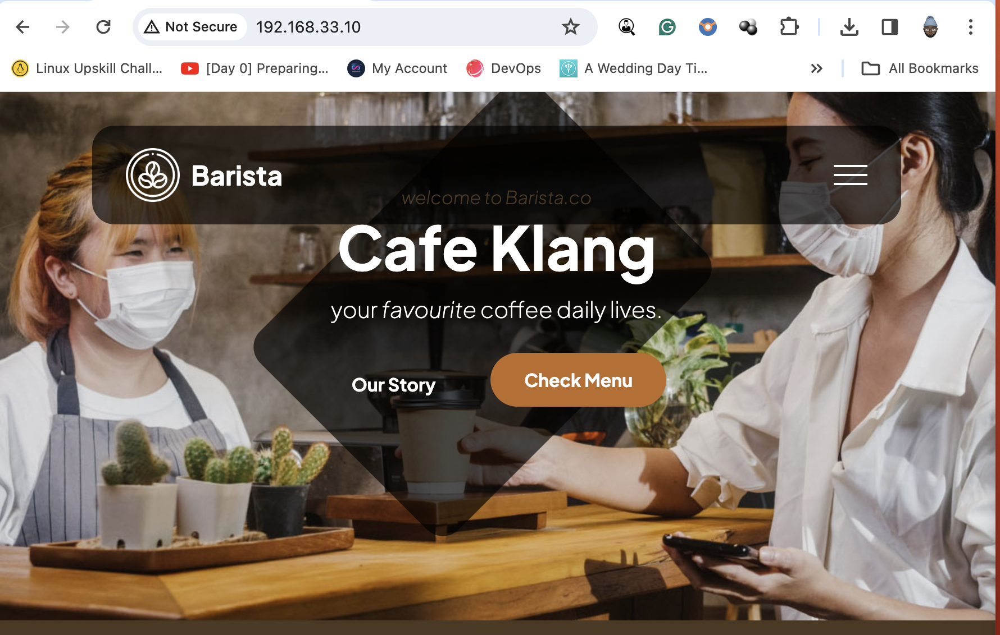

# Install Apache Web Server on Linux (CentOS)

## 📌 Project Purpose

This exercise demonstrates how to install and configure the Apache HTTP Server (`httpd`) on a CentOS-based Linux system. The goal is to provide hands-on experience in deploying a basic web server environment, a foundational skill in systems administration, DevOps, and cloud computing. 

By the end of this walkthrough, you'll understand:
- How to install Apache on CentOS
- How to manage the `httpd` service (start, enable, restart)
- How to allow HTTP traffic through the firewall
- Where to place and modify web content

---

## 🎯 Why This Project?

I chose this project to reinforce my foundational knowledge of Linux system administration and web server deployment. Installing and configuring Apache on CentOS is a practical, real-world task that demonstrates several core skills relevant to both traditional IT roles and modern DevOps/cloud environments.

Through this hands-on exercise, I aimed to:

- **Build confidence with Linux CLI** by managing packages, services, and firewalls.
- **Understand the web server stack** by setting up Apache and serving live content.
- **Learn service hardening basics**, such as enabling firewalls and managing startup behavior.
- **Prepare for advanced topics** like automated provisioning, web application hosting, and containerization.

This project also helped me appreciate how every component of a system — from firewall settings to service management — plays a role in the overall availability and security of a hosted application.

---

## 🛠️ Prerequisites

- A CentOS-based Linux machine (physical, virtual, or cloud instance)
- User with `sudo` privileges
- Internet connectivity for package installation

## 🚀 Installation Steps

1. Begin by creating a virtual machine on your local system. You can (follow this [link](https://github.com/KwesiLovesTech/Create-VM-manually-or-automatically-using-Vagrant-by-HashiCorp))
For this guide, I used an Ubuntu VM.

2. Switch to the root user by running the command "sudo su".

3. Update the package lists to ensure you have the latest information about available packages by executing "apt update".

4. Upgrade all currently installed packages to their latest versions with the command "apt upgrade -y".

5. Proceed to install the Apache HTTP Server by running "apt install apache2". This will set up the Apache web service on your virtual machine.

6. After installation, verify the network configuration to ensure the server is accessible. Run the following command "ip addr show" and copy and paste the ip address in your browser.
example below

it should display

 
7. Next step is to upload your web contents into the server. For this step we will use a free HTML [template](https://www.tooplate.com/zip-templates/2137_barista_cafe.zip) from tooplate.com

8. Install a downloader, unzip software using this command " apt install wget unzip"

9. Navigate to the temporary directory by executing "cd /tmp/"

10. Use the wget command to download the HTML template ZIP file by running this command "wget --no-check-certificate https://www.tooplate.com/zip-templates/2137_barista_cafe.zip"

11. Once the download is complete, unzip the downloaded file using "unzip 2137_barista_cafe.zip"

12. Copy all contents of the extracted folder into the Apache web server's HTML directory using " cp -r 2137_barista_cafe/* /var/www/html/ "

13. After copying the files, refresh the Ubuntu page in your web browser or simply paste the IP address of your server into the address bar. It should resemble the following preview: 

This image represents how the webpage should appear after successfully setting up the Apache web server. Congratulations!!