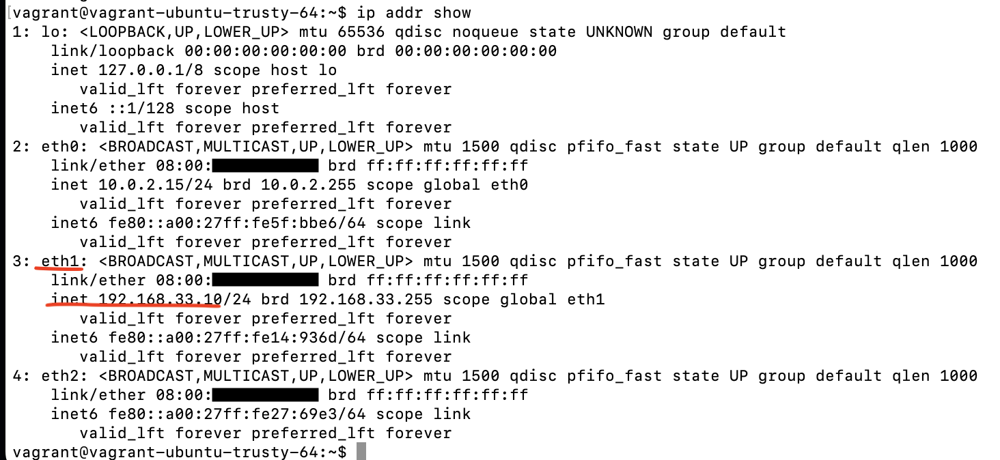
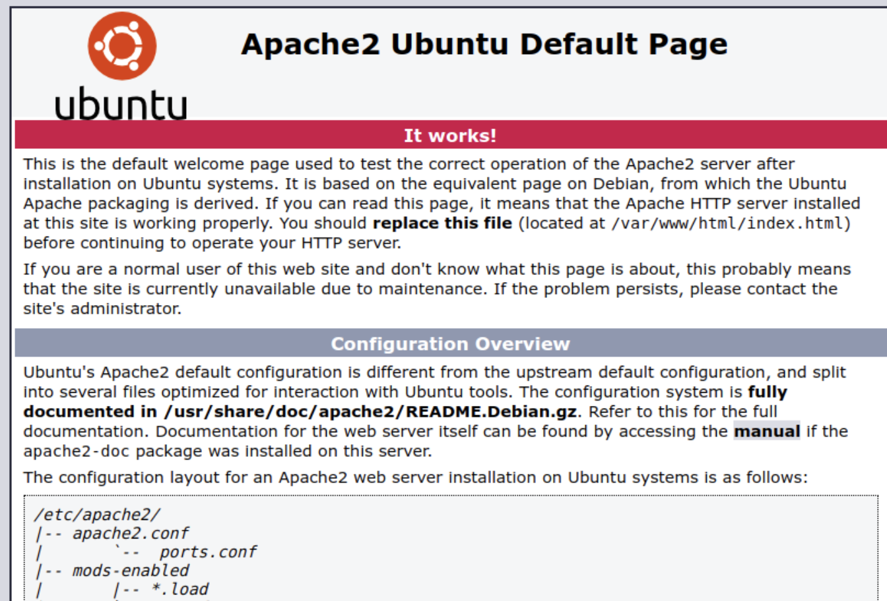

# Setup-Apache-Web-Server-on-Linux #
### Create a Local Virtual Machine and Deploy an HTML Template ###

1. Begin by creating a virtual machine on your local system. You can (follow this [link](https://github.com/KwesiLovesTech/Create-VM-manually-or-automatically-using-Vagrant-by-HashiCorp))
For this guide, I used an Ubuntu VM.

2. Switch to the root user by running the command "sudo su".

3. Update the package lists to ensure you have the latest information about available packages by executing "apt update".

4. Upgrade all currently installed packages to their latest versions with the command "apt upgrade -y".

5. Proceed to install the Apache HTTP Server by running "apt install apache2". This will set up the Apache web service on your virtual machine.

6. After installation, verify the network configuration to ensure the server is accessible. Run the following command "ip addr show" and copy and paste the ip address in your browser.
example below

it should display

 
7. the next step is to upload your web contents into the server. For this step we will use a free HTML [template](https://www.tooplate.com/zip-templates/2137_barista_cafe.zip) from tooplate.com

8. install a downloader, unzip software using this command " apt install wget unzip"

9. Navigate to the temporary directory by executing "cd /tmp/"

10. Use the wget command to download the HTML template ZIP file by running this command 

 "wget --no-check-certificate https://www.tooplate.com/zip-templates/2137_barista_cafe.zip"
 
11. Once the download is complete, unzip the downloaded file using "unzip 2137_barista_cafe.zip"
